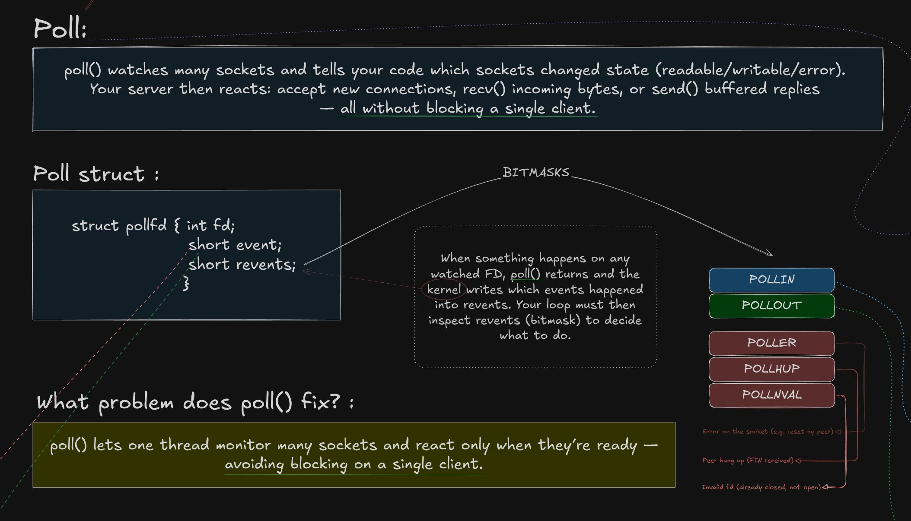
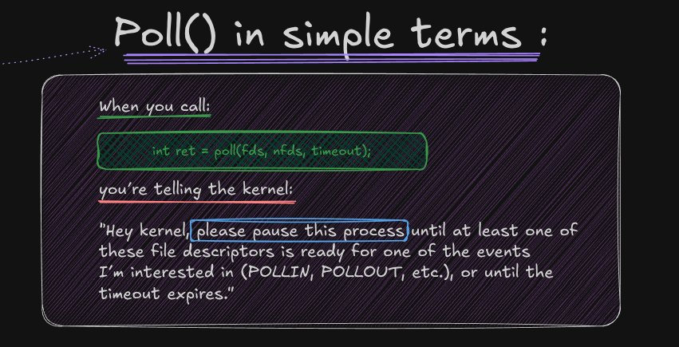
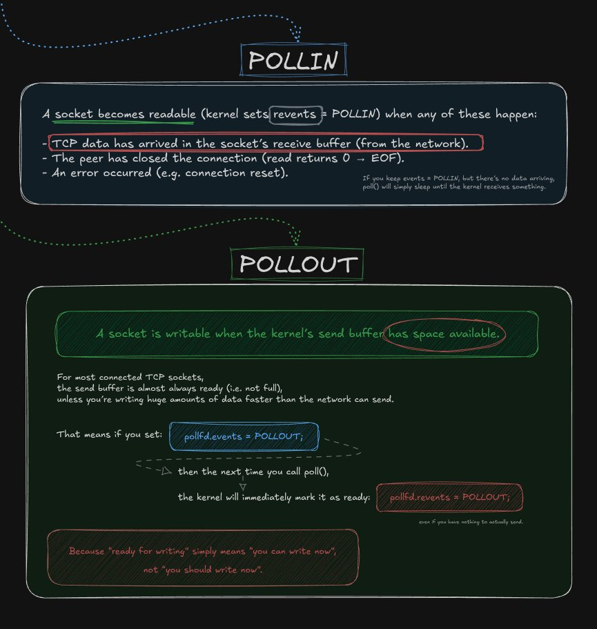
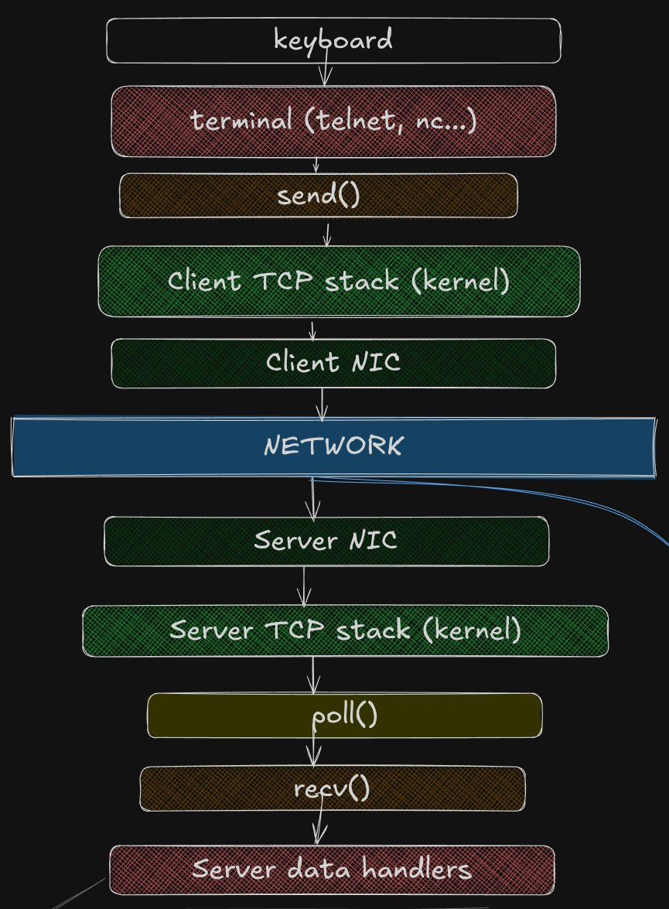
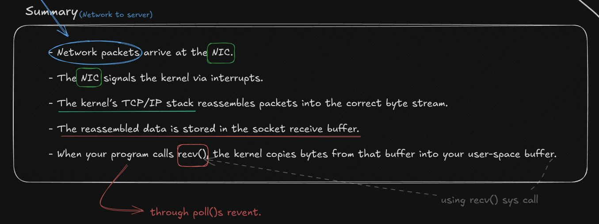
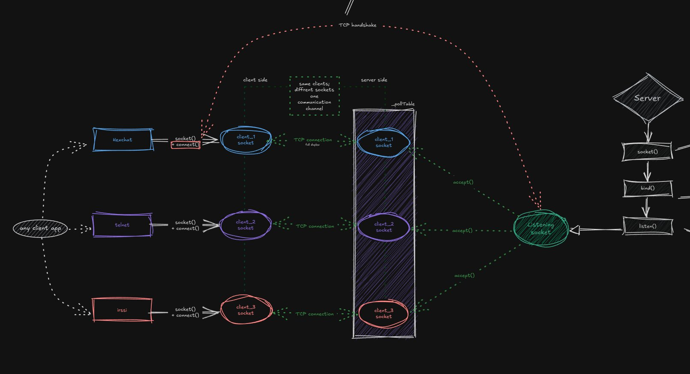

*This project has been created as part of the 42 curriculum by mobouifr and oer-refa.*

<div align="center">

# ft_irc

**A non-blocking IRC server written in C++98.**

*One thread. One `poll()` loop. Many clients.*

[](https://en.cppreference.com/w/cpp/98)
[](.)
[](https://42.fr)

</div>

---

## What is this?

`ft_irc` is a fully functional IRC server that handles multiple simultaneous clients over TCP — without threads, without `fork()`, and without any blocking I/O. Every connection, every message, every command flows through a single `poll()`-driven event loop.

The technically interesting part is not just protocol compliance. It's systems behavior: how a single process stays responsive to dozens of clients at once by reacting only to file descriptors the kernel has marked ready. No busy-waiting. No threads to synchronize. Just one loop, one table of descriptors, and careful I/O discipline.

The server is designed to work with real IRC clients. **HexChat** was the reference client during development and evaluation, with `telnet` and `nc` used for fragment and edge-case testing.

> No threads. No `fork()`. No blocking. Just `poll()` and the IRC protocol.

---

## How it works

### The `poll()` event loop

`poll()` is the scheduler of the entire server. Instead of blocking on one socket at a time, it asks the kernel which file descriptors are currently ready, then handles only those. This is why a single thread can accept new connections, read commands, and send replies — all concurrently.

```c
struct pollfd {
    int   fd;       // the file descriptor to watch
    short events;   // what you want to know about
    short revents;  // what actually happened (written by the kernel)
};
```

<div align="center">
  
    
  <sub><i>The pollfd struct and bitmask reference used in the server's event loop</i></sub>
</div>

<br/>

<div align="center">
  
    
  <sub><i>What poll() actually tells the kernel — in plain terms</i></sub>
</div>

<br/>

When `poll()` returns, the server inspects each entry in `_pollTable[i].revents`. `POLLIN` triggers a `recv()`. `POLLOUT` triggers a `send()`. Everything else is an error or a disconnect.

<div align="center">
  
    
  <sub><i>POLLIN and POLLOUT: when the kernel signals readiness and what to do next</i></sub>
</div>

---

### Data journey: from client to server

<div align="center">
  
    
  <sub><i>End-to-end path of a message: from IRC client keypress to server handler</i></sub>
</div>

<br/>

1. The user types a command in an IRC client
2. The client calls `send()` — bytes enter the client-side TCP stack
3. The kernel segments and transmits them via the NIC
4. The server kernel reassembles them into an ordered byte stream
5. The stream lands in the socket receive buffer — `poll()` returns with `POLLIN`
6. The event loop calls `recv()` and appends bytes to the per-client input buffer
7. The parser extracts complete `\r\n`-terminated lines, holding fragments until the next cycle
8. Each complete line is dispatched to its command handler, which queues a reply for the next `POLLOUT` cycle

<div align="center">
  
    
  <sub><i>How the kernel processes incoming packets before poll() and recv() are involved</i></sub>
</div>

---

### Command dispatch

Incoming bytes are not interpreted immediately. They accumulate in a per-client buffer until a full `\r\n`-terminated line is present — which prevents corruption when packets arrive fragmented across multiple `recv()` calls.

Each complete line is tokenized and routed to its handler: `PASS`, `NICK`, `USER`, `JOIN`, `PRIVMSG`, `NOTICE`, `MODE`, `KICK`, `INVITE`, `TOPIC`, `PART`, `CAP`, or `QUIT`. The handler validates connection state and arguments, builds the appropriate numeric or textual response, and queues outbound data for the next writable cycle.

---

### Architecture overview

<div align="center">
  
    
  <sub><i>Multiple clients, one listening socket, one poll table</i></sub>
</div>

The listening socket is created once via `socket()`, `bind()`, and `listen()`, then monitored permanently by `poll()`. Each `accept()` produces a new client file descriptor added to `_pollTable`. One communication channel per client. One event loop for all of them.

> [View the full interactive Excalidraw board →](https://excalidraw.com/#json=dRTYSnqIx4pPDoPVKPmPg,mmQf5wxbr-h_L6IkACEjPA)

---

## Features

| Feature | | Notes |
|---|:---:|---|
| Multi-client via `poll()` | ✓ | Single-threaded, fully non-blocking |
| Password authentication | ✓ | Required on connection via `PASS` |
| Nick & user registration | ✓ | Full `NICK` / `USER` flow |
| Channel join & broadcast | ✓ | `JOIN`, `PART`, channel-wide `PRIVMSG` |
| Private messaging | ✓ | User-to-user `PRIVMSG` and `NOTICE` |
| Operator privilege system | ✓ | Two roles: operator and regular user |
| `KICK` | ✓ | Eject a client from a channel |
| `INVITE` | ✓ | Invite a client into a channel |
| `TOPIC` | ✓ | View or set the channel topic |
| `MODE i` | ✓ | Invite-only channel |
| `MODE t` | ✓ | Operator-only topic changes |
| `MODE k` | ✓ | Channel password |
| `MODE o` | ✓ | Grant / revoke operator |
| `MODE l` | ✓ | User limit on channel |
| Partial packet buffering | ✓ | Fragments held until `\r\n` completes |
| Signal handling | ✓ | Clean shutdown on `SIGINT` and `SIGQUIT` |

---

## Technical constraints

- Strict **C++98** — no C++11 or later
- No external libraries, no Boost
- No `fork()`, no threads
- All I/O is non-blocking via `O_NONBLOCK`
- A single `poll()` handles everything: listen, accept, read, write
- On macOS: only `fcntl(fd, F_SETFL, O_NONBLOCK)` is permitted

> Reading or writing any file descriptor outside the `poll()`-driven flow is an automatic 0.

---

## Build and run

```bash
make
./ircserv <port> <password>
```

```bash
# Example
./ircserv 6667 mysecretpassword
```

**Connect with HexChat:**
Add a custom network pointing to `127.0.0.1/6667` with the password `mysecretpassword`.

**Connect with telnet:**
```bash
telnet 127.0.0.1 6667
```
```
PASS mysecretpassword
NICK mynick
USER myuser 0 * :my real name
```

**Test partial packet handling with nc:**
```bash
nc -C 127.0.0.1 6667
```
Type `com`, press `Ctrl+D`, type `mand`, press `Ctrl+D`, type `\r\n`. The server must reassemble fragments into one complete command before processing.

### Makefile rules

| Rule | Effect |
|---|---|
| `make` | Build `ircserv` |
| `make clean` | Remove object files |
| `make fclean` | Remove objects and binary |
| `make re` | Full clean rebuild |

---

## Project structure

```
ft_irc/
│
├── Makefile
├── Includes/
│   ├── Server.hpp               ← server class declarations
│   ├── Client.hpp               ← client class declarations
│   ├── Channel.hpp              ← channel class declarations
│   ├── CommandHandler.hpp       ← command dispatch interface
│   ├── Bot.hpp                  ← bot client declarations
│   ├── NumericReplies.hpp       ← IRC numeric reply constants
│   └── Headers.hpp              ← shared includes and definitions
│
├── Src/
│   ├── main.cpp
│   ├── Server/
│   │   ├── Server.cpp           ← server class implementation
│   │   ├── ServerCore.cpp       ← core runtime logic
│   │   ├── ServerInit.cpp       ← socket setup and initialization
│   │   ├── ServerPoll.cpp       ← poll() loop and event dispatch
│   │   ├── ServerIO.cpp         ← socket I/O operations
│   │   ├── ServerParseLine.cpp  ← input buffering and line parsing
│   │   ├── ServerHelpers.cpp    ← shared server utilities
│   │   └── ServerSig.cpp        ← SIGINT / SIGQUIT handling
│   ├── Client/
│   │   ├── Client.cpp
│   │   ├── ClientHelpers.cpp
│   │   └── Bot.cpp
│   ├── Channel/
│   │   ├── Channel.cpp
│   │   └── ChannelHelpers.cpp
│   └── Commands/
│       ├── CommandHandler.cpp   ← routing and dispatch
│       ├── CommandHelpers.cpp   ← shared command logic
│       ├── Pass.cpp · Nick.cpp · User.cpp · Cap.cpp
│       ├── Join.cpp · Part.cpp · Quit.cpp
│       ├── Privmsg.cpp · Notice.cpp
│       ├── Kick.cpp · Invite.cpp · Topic.cpp · Mode.cpp
│       └── (one file per command)
│
└── docs/assets/                 ← diagram screenshots used in this README
```

---

## Resources

- [RFC 1459 — IRC protocol specification](https://datatracker.ietf.org/doc/html/rfc1459)
- [Modern IRC reference](https://modern.ircdocs.horse/)
- [poll() man page](https://man7.org/linux/man-pages/man2/poll.2.html)
- [socket() man page](https://man7.org/linux/man-pages/man2/socket.2.html)
- [HexChat IRC client](https://hexchat.github.io/)
- [Full Excalidraw architecture board](https://excalidraw.com/#json=dRTYSnqIx4pPDoPVKPmPg,mmQf5wxbr-h_L6IkACEjPA)
- `man 2 recv` · `man 2 send` · `man 2 bind` · `man 2 listen` · `man 2 accept`
