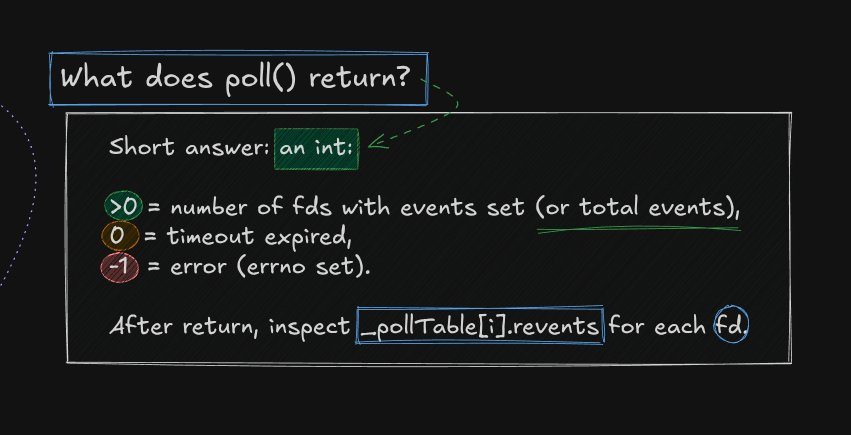

*This project has been created as part of the 42 curriculum by mobouifr.*

<p align="center">
# ft_irc
</p>

<p align="center">
  
  
  
  
</p>

---

## Table of Contents

- [Description](#description)
- [Project Identity](#project-identity)
- [Architecture](#architecture)
- [Technical Constraints](#technical-constraints)
- [Implemented Features](#implemented-features)
- [How It Works](#how-it-works)
- [Build and Run](#build-and-run)
- [Project Structure](#project-structure)
- [Resources](#resources)
- [AI Usage Disclosure](#ai-usage-disclosure)

---

## Description

ft_irc is a non-blocking IRC server written in strict C++98 as part of the 42 curriculum. It implements core IRC behavior over TCP using a single `poll()`-driven event loop, without threads and without `fork()`.

The technically interesting part is not only protocol compliance, but systems behavior: readiness-based I/O, per-client buffering, and deterministic command dispatch under concurrent traffic. The server is designed to work with real IRC clients — HexChat was used as the reference client during development and evaluation, alongside telnet and nc for testing.

---

## Project Identity

| Field            | Value                                      |
|------------------|--------------------------------------------|
| Binary           | `ircserv`                                  |
| Language         | C++ — strict C++98 standard                |
| Compiler flags   | `-Wall -Wextra -Werror -std=c++98`         |
| Run command      | `./ircserv <port> <password>`              |
| Reference client | HexChat                                    |
| Subject version  | 10.0                                       |

---

## Architecture

<p align="center">
  
  <br/>
  <em>Server architecture: multiple clients, one listening socket, one poll table.</em>
</p>

The listening socket is created once through `socket()`, `bind()`, and `listen()`, then monitored permanently by `poll()` for incoming connections. Each successful `accept()` produces a new dedicated client file descriptor, which is added to `_pollTable` alongside all other active sockets.

This gives one communication channel per client while keeping a single centralized event loop. The server remains single-threaded, yet manages many simultaneous clients by reacting only to descriptors the kernel has marked ready.

> **Interactive Diagram:** [View the full Excalidraw board (made by me)](https://excalidraw.com/#json=dRTYSnqIx4pPDoPVKPmPg,mmQf5wxbr-h_L6IkACEjPA) for more details.

---

## Technical Constraints

- Written in C++98 only — no C++11 or later features.
- No external libraries and no Boost.
- Forking is strictly forbidden.
- All I/O operations are non-blocking.
- A single `poll()` mechanism handles all operations: listen, accept, read, and write.
- On macOS, only `fcntl(fd, F_SETFL, O_NONBLOCK)` is permitted — no other flags.
- The server must remain stable under all conditions, including out-of-memory scenarios.

> **Critical:** reading or writing any file descriptor outside the `poll()`-driven flow results in a grade of 0.

---

## Implemented Features

- Multi-client support through one `poll()`-based event loop, with no blocking.
- Client authentication using a server password on connection.
- Nickname and username registration flow.
- Channel joining and channel-wide message broadcasting.
- Private messaging between users.
- Two roles: channel operators and regular users.
- Operator commands:
  - `KICK` — eject a client from a channel.
  - `INVITE` — invite a client into a channel.
  - `TOPIC` — view or modify the channel topic.
  - `MODE` — manage channel modes.
- Supported `MODE` flags:
  - `i` — set or remove invite-only mode.
  - `t` — restrict topic changes to operators only.
  - `k` — set or remove a channel key (password).
  - `o` — grant or revoke operator privilege.
  - `l` — set or remove a user limit on the channel.
- Partial packet aggregation: data is buffered until a complete `\r\n`-terminated command arrives.
- Clean shutdown on `SIGINT` and `SIGQUIT`.

---

## How It Works

### The Poll() Event Loop

`poll()` is the scheduler of the server. Instead of blocking on one socket at a time, it asks the kernel which descriptors are currently ready, then handles only those. This is why a single thread can accept new clients, read incoming commands, and send replies — all concurrently.

The `pollfd` struct is the unit of monitoring. Each active file descriptor gets one entry:

```c
struct pollfd {
    int   fd;       // the file descriptor to watch
    short events;   // events you want to know about
    short revents;  // events that actually occurred (written by the kernel)
};
```

<p align="center">
  
  <br/>
  <em>The pollfd struct and bitmask reference used in the server's event loop.</em>
</p>

When `poll()` is called, it tells the kernel to pause the process until at least one watched descriptor becomes ready:

<p align="center">
  
  <br/>
  <em>What poll() actually tells the kernel — in plain terms.</em>
</p>

When `poll()` returns, the server inspects the return value to decide what happened, then iterates through `_pollTable[i].revents` for each descriptor:

<p align="center">
  
  <br/>
  <em>poll() return values and how to read _pollTable[i].revents after each call.</em>
</p>

`POLLIN` and `POLLOUT` are the two main signals the server reacts to on every loop iteration:

<p align="center">
  
  <br/>
  <em>POLLIN and POLLOUT: when the kernel signals readiness and what to do next.</em>
</p>

> Because all file descriptors run in non-blocking mode (`O_NONBLOCK`), `recv()` and `send()` never stall the process. `poll()` is called first to confirm readiness — making the entire server single-threaded and non-blocking.

---

### Data Journey: From Client to Server

<p align="center">
  
  <br/>
  <em>End-to-end path of a message: from IRC client keypress to server handler.</em>
</p>

<p align="center">
  
  <br/>
  <em>How the kernel processes incoming packets before poll() and recv() are involved.</em>
</p>

1. The user types a command in an IRC client (HexChat, telnet, or nc).
2. The client calls `send()`, which passes bytes to the client-side kernel TCP stack.
3. The kernel encapsulates data into TCP segments and transmits them via the NIC.
4. The server NIC receives the packets, and the server kernel TCP/IP stack reassembles them into an ordered byte stream.
5. The byte stream is placed in the socket receive buffer. The kernel marks the fd as readable and `poll()` returns with `POLLIN` set on that entry.
6. The event loop calls `recv()` and appends bytes to the per-client input buffer.
7. The parser extracts complete IRC lines terminated by `\r\n`, holding incomplete fragments until the next read cycle.
8. Each complete line is dispatched to its command handler, which builds a reply and queues it for `send()` on the next `POLLOUT`-ready cycle.

---

### Command Dispatch

Incoming bytes are not interpreted immediately as commands — they are first accumulated in a per-client buffer. The parser only acts when a full `\r\n`-terminated line is present, which prevents corruption when packets arrive fragmented across multiple `recv()` calls.

Each complete command string is tokenized and routed to its handler: `PASS`, `NICK`, `USER`, `JOIN`, `PRIVMSG`, `NOTICE`, `MODE`, `KICK`, `INVITE`, `TOPIC`, `PART`, `CAP`, or `QUIT`. The handler validates connection state and arguments, builds the appropriate numeric or textual response, and queues outbound data for transmission on the next writable cycle.

---

## Build and Run

**Build:**

```bash
make
```

**Run:**

```bash
./ircserv <port> <password>
```

**Example:**

```bash
./ircserv 6667 mysecretpassword
```

**Connect with HexChat (reference client):**

Install and run HexChat, open the Network List, and add a custom network to `127.0.0.1/6667` with the password `mysecretpassword`.

**Connect with telnet (for manual testing):**

```bash
telnet 127.0.0.1 6667
```

Then manually authenticate:

```text
PASS mysecretpassword
NICK mynick
USER myuser 0 * :my real name
```

**Test partial data handling with nc:**

The subject requires the server to handle commands sent in multiple fragments. Use `nc` with `Ctrl+D` to flush partial input between keystrokes:

```bash
nc -C 127.0.0.1 6667
```

Type `com`, press `Ctrl+D`, type `man`, press `Ctrl+D`, type `d` and press `Enter`. The server must reassemble these fragments into a single complete command before processing it.

**Makefile targets:**

| Target        | Effect                              |
|---------------|-------------------------------------|
| `make`        | Build the `ircserv` binary          |
| `make clean`  | Remove object files                 |
| `make fclean` | Remove object files and binary      |
| `make re`     | Full clean rebuild                  |

---

## Project Structure

```text
.
├── Makefile                       # Build rules and compilation flags
├── docs/
│   └── assets/                    # Diagram screenshots embedded in README
├── Includes/                      # Header files (.hpp)
│   ├── Bot.hpp                    # Bot client declarations
│   ├── Channel.hpp                # Channel class declarations
│   ├── Client.hpp                 # Client class declarations
│   ├── CommandHandler.hpp         # Command dispatch interface
│   ├── Headers.hpp                # Shared includes and common definitions
│   ├── NumericReplies.hpp         # IRC numeric reply constants and helpers
│   └── Server.hpp                 # Server class declarations
├── Src/                           # Source files (.cpp)
│   ├── main.cpp                   # Program entry point
│   ├── Channel/
│   │   ├── Channel.cpp            # Core channel behavior
│   │   └── ChannelHelpers.cpp     # Channel utility functions
│   ├── Client/
│   │   ├── Bot.cpp                # Bot implementation
│   │   ├── Client.cpp             # Core client behavior
│   │   └── ClientHelpers.cpp      # Client utility functions
│   ├── Commands/
│   │   ├── Cap.cpp                # CAP negotiation handling
│   │   ├── CommandHandler.cpp     # Command routing and dispatch
│   │   ├── CommandHelpers.cpp     # Shared command logic
│   │   ├── Invite.cpp             # INVITE command
│   │   ├── Join.cpp               # JOIN command
│   │   ├── Kick.cpp               # KICK command
│   │   ├── Mode.cpp               # MODE command
│   │   ├── Nick.cpp               # NICK command
│   │   ├── Notice.cpp             # NOTICE command
│   │   ├── Part.cpp               # PART command
│   │   ├── Pass.cpp               # PASS command
│   │   ├── Privmsg.cpp            # PRIVMSG command
│   │   ├── Quit.cpp               # QUIT command
│   │   ├── Topic.cpp              # TOPIC command
│   │   └── User.cpp               # USER command
│   └── Server/
│       ├── Server.cpp             # Server class implementation
│       ├── ServerCore.cpp         # Core server runtime logic
│       ├── ServerHelpers.cpp      # Shared server utilities
│       ├── ServerInit.cpp         # Initialization and socket setup
│       ├── ServerIO.cpp           # Socket I/O operations
│       ├── ServerParseLine.cpp    # Input line parsing and buffering
│       ├── ServerPoll.cpp         # poll() loop and event dispatch
│       └── ServerSig.cpp          # Signal handling (SIGINT/SIGQUIT)
└── ircserv                        # Compiled binary (git-ignored)
```

---

## Resources

- RFC 1459 — IRC protocol specification: https://datatracker.ietf.org/doc/html/rfc1459
- Modern IRC reference: https://modern.ircdocs.horse/
- `poll()` man page: https://man7.org/linux/man-pages/man2/poll.2.html
- `socket()` man page: https://man7.org/linux/man-pages/man2/socket.2.html
- TCP/IP fundamentals (IBM): https://www.ibm.com/docs/en/aix/7.1?topic=management-transmission-control-protocolinternet-protocol
- HexChat IRC client: https://hexchat.github.io/
- Full Excalidraw board: https://excalidraw.com/#json=dRTYSnqIx4pPDoPVKPmPg,mmQf5wxbr-h_L6IkACEjPA

---

## AI Usage Disclosure

AI was used to assist with README structure and writing, understanding RFC 1459 command formats, reviewing documentation clarity.
